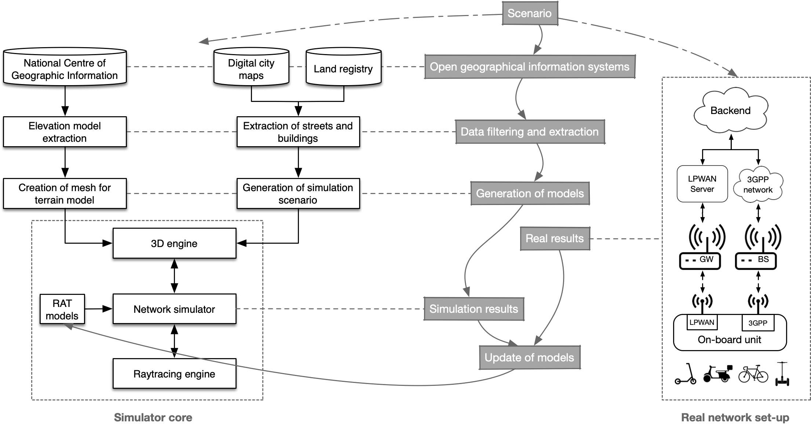

 

The adoption of Low-Power Wide-Area Networks (LPWAN) for interconnecting remote wireless sensors has become a reality in smart scenarios, covering communications needs of large Internet of Things (IoT) deployments. Expected operation and performance of such network scenarios, which can range hundredths or thousands of nodes and tens of squared kilometres, should be assessed before carrying out the deployment to save installation and maintenance costs. Common network planning tools can help to roughly study potential coverage, but network simulation offers fine-grained information about network performances. Nevertheless, current simulation frameworks include limited support for LPWAN communication technologies, either based or not on operator infrastructure, they are based on propagation models created on the basis of statistical and empirical measurements that do not consider scenario particularities, such as terrain elevation, buildings or vegetation, and mobile IoT scenarios are not considered, which is a great lack in the literature.

The WILLIOT project proposes a simulation framework using ray-tracing for LPWAN, 5G and beyond 5G (B5G) networks if the field of mobile IoT, which will provide accurate performance indicators under different network configuration parameters and variable reference scenarios. The next novel contributions are envisaged in WILLIOT: an LPWAN/5G/B5G simulation framework using ray tracing, capable of estimating network performance better than tools based on theoretical or empirical propagation models; generation of target 3D environments by extraction of geometrical models from open-source geographic information systems; and comparison of simulation and real results from extensive field campaigns considering mobile scenarios, for updating simulation models and determining ground truth power measurements. Simulation results will be extracted from modelled scenarios and compared with real measurements taken for a real LoRaWAN/5G deployment based on connected personal mobility vehicles. This will involve a mobile IoT scenario covering a broad area with diverse connectivity locations.
The project exploits the synergy among telecommunications, computer science and electronics to set-up a simulation and experimental evaluation scenario to perform realistic analysis of Next Generation IoT (NGIoT) scenarios that will involve mobile nodes in urban areas. 

The objectives of the project are:

<ul>
<li>O1: Develop simulation models for LPWAN and 5G communication RATs for mobile IoT scenarios.</li>
<li>O2: Create tools for 3D environment generation from open digital models with elevation and buildings.</li>
<li>O3: Integrate a raytracing engine for realistic simulation of mobile IoT scenarios.</li>
<li>O4: Perform a comparative evaluation of simulated and real measurements taken from a reference scenario properly modelled and using real prototypes and network deployments.</li>
<li>O5: Validate Radio Signal Strength Indicators (RSSI) provided by real LoRa and cellular network equipment as compared with ground truth transmission in the reference radio band. </li>
<li>O6: Analyse the impact of mobility in specific IoT technologies, including LPWAN RATs.</li>
</ul>

